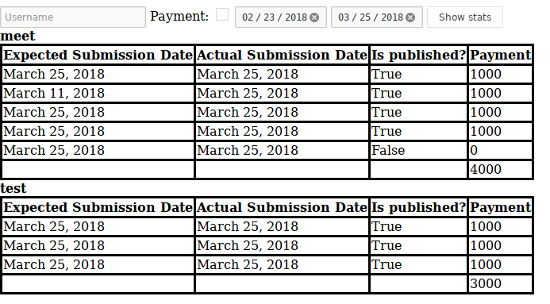

# fossee-stwebwork

This project has been created as part of
[screening task](http://spoken-tutorial.org/stwebwork/) for
[FOSSEE Summer Fellowship 2018](https://fossee.in/fellowship).

## Models

```
- FOSSEE

- TutorialDetail
 `-- expected_submission_date
  |- actual_submission_date
  |- is_published
  |- contributor

- Payment
 `-- contributor
  |- number_of_tutorials(published)
```

## Views

**Statistics view**

Statistics view allows filtering on the basis of following:
- **Date range**: If either of the expected or actual submission date lies in this
  range, it'll appear in the view. Default is last 30 days.
- **Payment**: Show the payment corresponding to each tutorial, and total for
  each user.
- **User**: Show the statistics only for given user.


